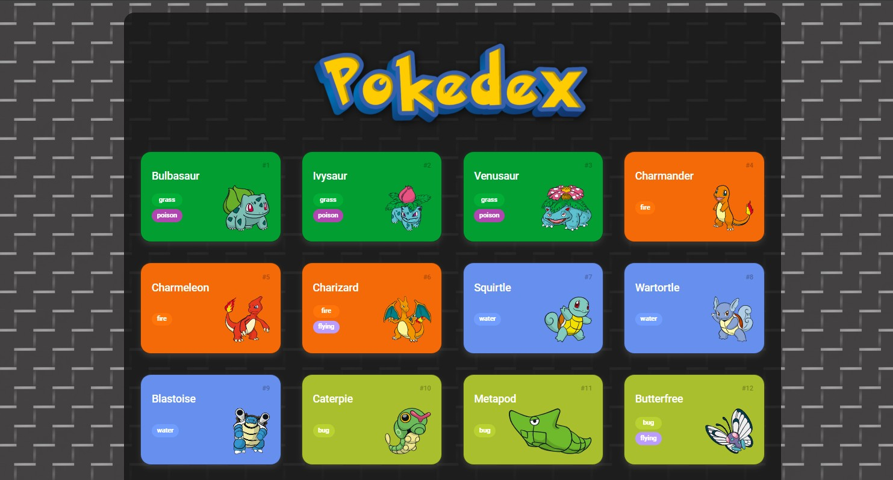
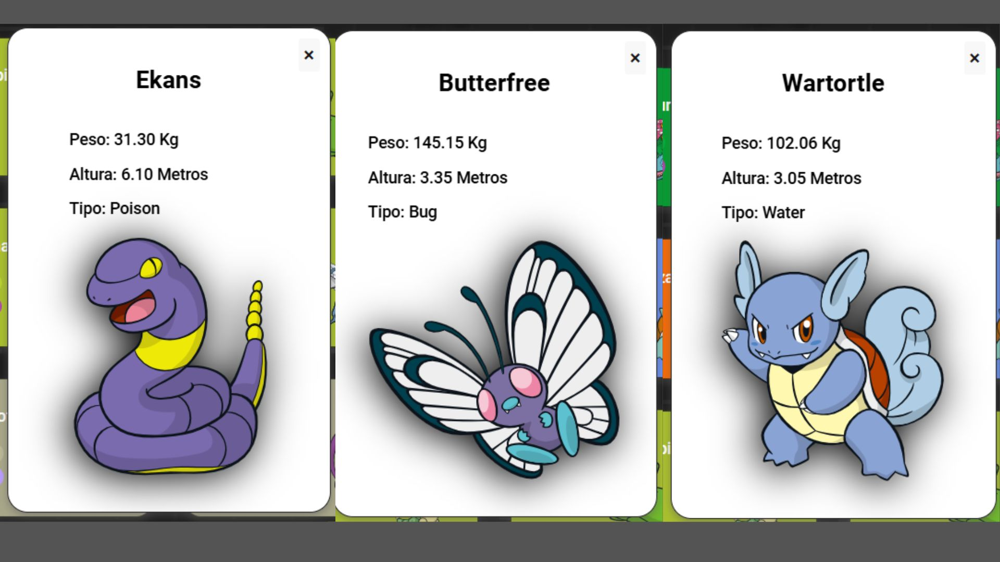

#  Projeto Construindo uma Pokédex com JavaScript
Neste incrível projeto disponibilizado pela DIO para os participantes do Bootcamp Ri Happy - Front-end do Zero, o principal objetivo era aprender mais sobre HTML, CSS e JavaScript na prática e fixar ainda mais diversos conceitos abordados durante o curso. Nesse projeto, era necessário implementar a segunda parte de uma Pokédex feita com API. Essa etapa consistia em, ao clicarmos em um Pokémon, abrir uma aba com suas informações. Além disso, era opcional que cada aluno acrescentasse ao projeto o seu "próprio toque". Sendo assim, fiz algumas melhorias que julguei necessárias durante o desenvolvimento, tanto em questões estéticas quanto de funcionalidade.

###  O que foi necessário para realizar este projeto:

O projeto consistiu em configurar e executar um ambiente de desenvolvimento utilizando ferramentas essenciais. Primeiramente, foi necessário instalar o Git para o controle de versões e o Node.js para rodar a aplicação.

Uma IDE (Ambiente de Desenvolvimento Integrado) foi configurada para facilitar a codificação, e, neste caso, optei pelo Visual Studio Code (VSCode). O projeto foi executado via a extensão do VSCode chamada Live Server. Após o desenvolvimento com base em um API de pokemos implementada que deixei o link dela abaixo, o código foi versionado e compartilhado em um repositório no GitHub, garantindo o backup e o gerenciamento das versões do projeto.

Abaixo, deixarei alguns links para downloads oficiais de tudo o que foi utilizado para Windows.

```
 Visual Studio Code - https://code.visualstudio.com/
```
```
 GitBash - https://git-scm.com/downloads/win
```
```
 Node.js - https://nodejs.org/pt
```
```
 ID da extensão Live Server - ritwickdey.LiveServer
```
```
 PokéAPI - https://pokeapi.co/
```
### 🪄 Imagens do Projeto

### Pagina Principal


### Aba com as informações dos pokemos



